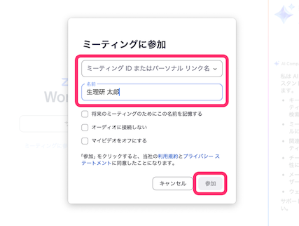
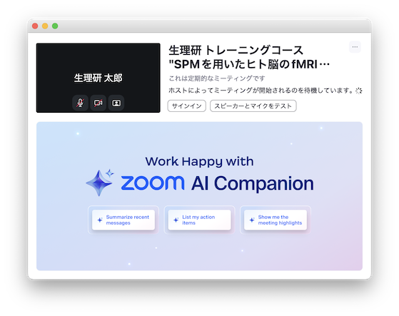
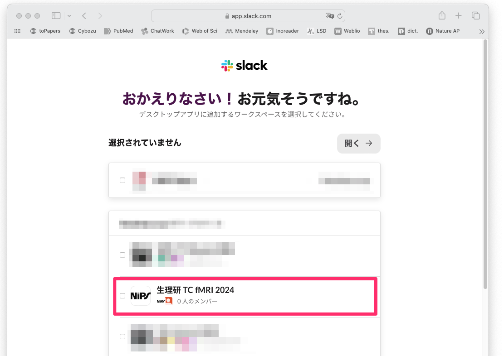
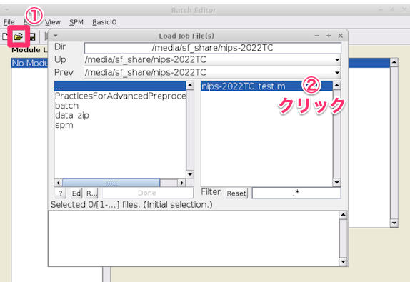

### 第35回生理科学実験技術トレーニングコース

# SPMを用いたヒト脳のfMRIデータ解析入門

2024年7月30-8月2日に生理学研究所でオンライン開催する **『第35回生理科学実験技術トレーニングコース・SPMを用いたヒト脳のfMRIデータ解析入門』** の参加者を対象とした情報提供サイトです。随時、情報を追加していきますので、このサイトへ定期的にアクセスするようにして下さい。

## 新着情報

- 2024.07.15 講義スケジュールの一部を変更しました
- 2024.07.01 トレーニングコース用ウェブサイトを立ち上げました


## スタッフ（運営、講師、チューター）

- 生理学研究所 脳機能計測・支援センター 生体機能情報解析室

- 国際電気通信基礎技術研究所(ATR) 河内山隆紀

- 筑波大学 根本清貴


## 開催案内

- オンライン開催です

- Zoomの開始時間は、**08：30** です


## 当日のタイムテーブル　(2024/7/15 時点)

日程 | 内容
---- | ----
7月30日（火） |
08:30 | Zoomオープン
09:00-09:20 | コース概要など説明（福永）
09:20-10:20 | 講義：機能的磁気共鳴現象画像法概論（福永）
10:20-10:40 | SPM概要説明（河内山）
10:40-11:00 | 講義：実験課題の説明（伊津野)
11:00-12:00 | 講義・実習：Preprocessing（小池・吉岡）
12:00-13:00 | -- 昼休み --
13:00-16:15 | 講義・実習：Preprocessing（小池・吉岡）
16:15-17:00 | 講義・実習：GUIを用いたバッチ作成（郷田）
7月31日（水） |
08:30       | Zoomオープン
09:00-11:00 | 講義：統計検定１（河内山）
11:00-12:00 | 実習：個人解析（吉岡）
12:00-13:00 | -- 昼休み --
13:00-14:00 | 講義：統計検定２（河内山）
14:00-15:30 | 実習：個人解析と結果の表示（吉岡）
15:30-17:00 | 講義・実習：表の読み方と図の作り方（小池）
8月1日（木） |
08:30 | Zoomオープン
9:00-10:00 | 講義：グループ解析（河内山）
10:00-11:00 | 実習：グループ解析（吉岡）
11:00-12:30 | fMRIの課題設計（小池）
12:30-13:30 | -- 昼休み --
13:30-15:00 | 講義：HCP pipeline について(山本）
15:00-17:00 | 講義：応用的な手法について(Preprocessing）(山本）
8月2日（金） |
08:30 | Zoomオープン
9:00-11:00 | 講義：応用的な手法について(fMRI編)(三浦）
11:00-12:00 | 質疑応答・個別質問など
 | |　


----

 ## パソコンの準備について

 - トレーニングコースでは、受講者にご自身でPCを準備して頂き、実際に操作しながら学んでいきます。PCのスペックについては、以下の **推奨条件** を参考にして下さい

    - OS: Windows10,11 64bit版 または macOS 10.14.6（Mojave）- 12.0.1 (Monterey）
    - CPU: Intel Core i7/i9、Intel Core i5（クロック周波数2.0GHz以上）、または AMD Ryzen 5以上の性能を有するもの **注意: 現在、Apple M1/M2はVirtualBoxで仮想マシンを動作できないため、Lin4Neuroは動作できません。以下をご覧ください**
    - メモリ：8GB以上 (可能ならば16GB以上を推奨します)
    - ハードディスク：100GB以上の空き容量 (外付けハードディスクも可)
    - 2ボタン以上のUSBマウス (必須ではありませんが、持っていると便利です)

- Lin4Neuroでの受講を推奨しますが、macOS native 環境で受講したい方々のために、インストラクションを準備しました。[こちら](macOS_native.md){:target="_blank"} をご確認ください
    - 本コースの受講で必要なSPMのインストールのみで結構です。なお、Native環境でのSPMの利用には、**<u>MATLABのライセンスが必要</u>** です。 

- Zoomは画面共有でメモリを相当消費します。そのため、Zoomで受講するための別のPCもしくはタブレットをご準備ください。解析用のPCとZoom用のPCは別々で全く支障ありません。
  
----

## Zoomの設定

- トレーニングコースはZoomにて開催します

- Zoomは2023年7月1日現在、バージョン5.15.2になっています。こちらを入手してください
    - 以下のリンクをクリックすることで、最新版のZoomを入手できます。(すでにインストールされている方でも以下のリンクからインストーラーを入手することでアップデートできます)
    - Windows: [https://zoom.us/client/latest/ZoomInstaller.exe](https://zoom.us/client/latest/ZoomInstaller.exe)
    - macOS(Intel Core): [https://zoom.us/client/5.15.2.19786/zoomusInstallerFull.pkg](https://zoom.us/client/5.15.2.19786/zoomusInstallerFull.pkg)
    - macOS(Apple M1/M2): [https://zoom.us/client/5.15.2.19786/zoomusInstallerFull.pkg?archType=arm64](https://zoom.us/client/5.15.2.19786/zoomusInstallerFull.pkg?archType=arm64)

- 画面の共有の設定だけ変更すると受講しやすくなります
    - Zoomを起動し、ミーティングに参加をクリックします

    

    - ミーティングに参加します（ **メールでお知らせしたミーティングID、受講者氏名[実名]** を入力）

    

    - ミーティングパスコードを入力します（ **メールでお知らせしたミーティングパスコード** を入力）

    

    - 正しくミーティングに参加できると下の画面が表示されます
  
    

    - この画面が表示されている状態で、Zoomの環境設定画面を表示させます
    - 左のメニューから「画面の共有」のタブをクリックし、「画面を共有している場合のウィンドウのサイズ」を「現在のサイズを保持する」に変更します。これにより、講師が画面を共有した場合に、Zoomが全画面モードにならずにすみます

    

    - Zoomの設定は以上で終了です

----

## Slackの設定

- チュートリアルでは Slack というツールを使って、事務連絡や当日の質疑応答を行います。以下の手順で設定してください


### ウェブブラウザでの設定

 - 受講者の皆様にメールで招待状が届きます。「今すぐ参加」をクリックしてください

 　

 - Slackのアカウントを持っていない場合、名前の入力画面が出てきます。　**受講者氏名[実名]** を入力し、"続行する"をクリックしてください

 　

### アプリの入手

 - 次に、[slackのダウンロードサイト](https://slack.com/downloads)にアクセスし、自分の使っているOSにあったSlackアプリをダウンロードしてください。Slackはブラウザからも利用可能ですが、アプリの方が使い勝手がいいかもしれません。スクリーンショットはMac版Slackとなっていますが、Windowsの方はWindows版をダウンロードしてください

  


 - アプリを起動すると、はじめての方の場合は、下図のような画面になりますので、"Sign In to Slack"をクリックします

  

 - すでにSlackをお使いの方は、以下の3つのどれかの方法で、ワークスペースにサインインします

 - 左にある＋キーをクリックして、「他のワークスペースにサインインする」をクリックします

  

 - 左上のハンバーガーメニューをクリックし、「ワークスペースを追加」-> 「他のワークスペースにサインインする」をクリックします

  

 - メニューの「ウィンドウ」から「他のワークスペースにサインインする」をクリックします

  

 - ログイン画面が出ますので、メールアドレスを入力します

  

 - そうすると、メールアドレスにログインのためのコードが送信されますのでそれを入力します

  

 - NIPS TC fMRI 2023 をクリックします

  

 - "Slackを開きますか？"という質問が出た場合は、"Slackを開く"をクリックします

 - そうすると、第34回生理研トレーニングコース用のワークスペースに入ることができます

  

### チャンネルの使い分け

 - いくつかチャンネルが準備されています。以下のように使い分けていきます

 - 01_事前準備: 事前準備に関する連絡を行うチャンネルです。テキストのアップデートの連絡などをこちらで行います

 - 02_初心者: トレーニングコースにおいて、「講師に聞くほどでもないけど、初心者だから聞いておきたい」質問を受けるチャンネルです。講義中、講師はこのチャンネルは見ません。その代わり、チューターが皆様の質問に対してお答えします。

 - 03_preprocess: Preprocessingのの講義、実習に関する質問を受けるチャンネルです。

 - 04_statistics: 統計の講義、実習に関する質問を受けるチャンネルです。

 - 05_その他の講義: その他の講義に関する質問を受けるチャンネルです。

 - general: 上記以外の質問を受けるチャンネルです。質問により、回答できない場合があります

### お願い

 - トレーニングコースでは、すべて実名でやりとりをしたいと思います。ニックネームではなく、ご自身の名前をフルネームで表示するようにしてください。スタッフはすべて氏名の前にS_がついています

 - テキストだけのやりとりになりますので、どうぞやわらかな言葉での発言をしていただくようにお願いいたします。


----

## 事前準備

- **トレーニングコースの準備に、約3-4時間必要となります。なお、準備が終わった方にのみ当日のZoomのリンクが送信されますので、必ず準備を行ってください。準備なしの参加はできません**

- 今回は完全オンライン開催のため、受講者専用サイトに記載されているVirtualBox＋Lin4Neuroの組み合わせによる参加を前提とします。脳画像解析の初心者の方々は受講者専用サイトに記載されている通りに事前準備を行いトレーニングコースへ参加することを強く推奨します

- **Lin4Neuroは、筑波大学の根本清貴先生が開発、配布されているLinux上に構築された脳画像解析ツール群です。根本先生のご厚意により、トレーニングコースで利用させて頂きます**
  - [Lin4Neuro](https://www.nemotos.net/?page_id=161)

- 自分自身で基礎的なトラブルシューティングが行える脳画像解析の経験が豊富な中級者以上の方々は、受講者専用サイトに記載されている以外の解析環境（例えば受講者自身が構築した解析環境など）でもトレーニングコースに参加可能ですが、原則としてチューターによるサポートの対象外とさせて頂きます。ご理解、ご協力の程、よろしくお願いします

- 今回のトレーニングコースで使用するLin4Neuroのバージョンは、L4N-2004-NIPS-20230630です。**過去のLin4Neuroは使用できませんのでご注意ください**

- ソフトウェアとデータのダウンロードで合計**30GB程度ダウンロードします**。Pocket Wi-Fiなどでは通信量にご注意下さい。**職場やご自宅のLAN環境からの作業**を強くお奨めします
　

### 1. トレーニングコース用Lin4Neuroのセットアップ

- **以下のページを参考にセットアップをして下さい**
  - [生理研トレーニングコース用Lin4Neuroのセットアップ](https://kytk.github.io/nips-web-202307)
　

### 2. SPMの確認

- Lin4Neuroにログインします

- 画面左下の脳アイコンの右側にあるターミナルアイコンをクリックし、ターミナルを起動します

    

- ターミナルに以下をタイプします。コピペする場合は、Windows, macOSともに コピーした後に、マウスで右クリックして貼り付けを選ぶか、 Ctrl (ctrl) + Shift + V をタイプすることによりペーストできます(以下、タイプが必要なところはすべて同様に作業できます)

    ```
    spm fmri
    ```

- 以下のような画面が出ます。SPMを使用中は、ターミナルは閉じないで下さい

    

- 少し時間がかかりますが、以下のようなウインドウが出れば、SPMがきちんと動作することを確認できます

    

- 起動の確認が終われば、"Quit" を選択してSPMを終了します


### 3. トレーニングコーステキストの入手 (所要時間約3分)

- 本トレーニングコースで使用するテキストは、GitLabというデータ共有サービスを通して配布します。ここで配布されるものは、トレーニングコースの直前まで更新される可能性がありますので、こまめに（特に参加直前に）アップデートするようにして下さい

1. 初めてセットアップする時: ターミナル (Lin4Neuro では、左下のスタートアイコンの隣にあるアイコンから起動できます) から以下を実行して下さい

    ```
    cd /media/sf_share
    メールで示されているコマンドをここにタイプします
    (セキュリティの都合でここには記しません)
    ```

2. 更新する時: ターミナルから以下を実行してください

    ```
    cd /media/sf_share/nips-2023TC
    git pull
    ```

- こうすると、`/media/sf_share/nips-2023TC` の下に `spm`, `nips-2023TC_test.m`, `nips-2023TC_textbook.html`, `set_data.sh` といったフォルダやファイルが生成されます

    


- `nips-2023TC_textbook.html` の中にテキストへのリンクが掲載されています

- その他のフォルダは講義で使用します

#### プロキシサーバーなどを使っている場合

- PCがプロキシサーバを経由して外部ネットワークに接続されている場合は、先にターミナルから以下のコマンドを入力し、Gitに対するプロキシ設定を行って下さい

    ```
    git config --global http.proxy  http://プロキシ名:ポート番号
    git config --global https.proxy http://プロキシ名:ポート番号
    ```

- プロキシ名やポート番号は、所属機関･部署のネットワーク管理者にお尋ね下さい

- プロキシ設定が不要になった時は、以下のコマンドによって解除できます：

    ```
    git config --global --unset http.proxy
    git config --global --unset https.proxy
    ```

### 4. データの入手 (所要時間約10分)

- トレーニングコースに使うデータは非常に大きいため、GitLabではなく、別にダウンロードしていただきます
   
- データのダウンロードを行った後、ターミナルから以下をタイプしてください

    ```
    cd /media/sf_share/nips-2023TC
    bash ./set_data.sh
    ```

- こうすると、`spm` フォルダに `Localizer` `LOOanalysis` `Manuals` が、`PracticesForAdvancedPreprocessing` フォルダに `DICOM` `Practice2_Topup` `Script_SetUpFilesForPractice1.sh` ができます
　


### 5. 確認のためのバッチスクリプトを実行 (所要時間約5分)

- 環境が整っているかを確認するために、バッチスクリプトを実行していただきます

- ターミナルからSPMを起動してください

- SPM12 MenuウインドウからBatchを選択してください

    

- 以下のウインドウが表示されますので、①-②の順でバッチスクリプトを読み込みます

    

- `nips-2023TC_test.m` が選択されたことを確認して、DONEを選択します

    

- ウインドウ上部の三角がグリーンに変化するので選択します

    

- MRIの断面画像が表示されます

    

- 画像が正しく表示された方は、準備がすべて整ったことになります

    - もし、正しく表示できなかった場合は、データの入手からやり直して下さい

- ここまでたどりつけない場合は、事前サポートが必要になります。今回、Zoomのため、トレーニングコース当日の個別サポートが提供できませんので、このプロセスは必須とさせていただきます


### 6. Lin4Neuro への Google chrome のインストール (所要時間5分)

- Lin4NeuroにGoogle Chromeをインストールしたい方向けに、説明動画を準備しました。[こちら](https://vimeo.com/487737208)からご確認ください
 

---

## 問い合わせ

- 準備がうまくいかない時は、メールで案内した Slack の事前準備チャンネルで問い合わせ下さい。

- [nipstcfmri2023.slack.com](https://nipstcfmri2023.slack.com/)
