### 第37回生理科学実験技術トレーニングコース

# SPMを用いたヒト脳のfMRIデータ解析入門

2026年8月3-8月7日に生理学研究所でオンライン開催する **『第37回生理科学実験技術トレーニングコース・SPMを用いたヒト脳のfMRIデータ解析入門』** の参加者を対象とした情報提供サイトです。随時、情報を追加していきますので、このサイトへ定期的にアクセスするようにして下さい。

## 新着情報
- 2026.07.21 講義スケジュールの一部を変更しました
- 2026.07.17 トレーニングコース用ウェブサイトを立ち上げました


## スタッフ（運営、講師、チューター）
- 生理学研究所 脳機能計測・支援センター 生体機能情報解析室
- 国際電気通信基礎技術研究所(ATR) 河内山隆紀
- 筑波大学 根本清貴


## 開催案内
- オンライン開催です
- Zoomの開始時間は、**08:30** です


## 当日のタイムテーブル　(2026/7/17 時点)

日程 | 内容
---- | ----
8月4日（火） |
08:30 | Zoomオープン
09:00-09:20 | コース概要など説明（福永）
09:20-10:20 | 講義：機能的磁気共鳴現象画像法概論（福永）
10:20-10:40 | SPM概要説明（河内山）
10:40-11:00 | 講義：実験課題の説明（福永)
11:00-12:00 | 講義・実習：Preprocessing（小池・吉岡）
12:00-13:00 | -- 昼休み （Zoom 集合写真）--
13:00-16:15 | 講義・実習：Preprocessing（小池・吉岡）
16:15-17:00 | 講義・実習：GUIを用いたバッチ作成（郷田）
8月5日（水） |
08:30       | Zoomオープン
09:00-11:00 | 講義：統計検定１（河内山）
11:00-12:00 | 実習：個人解析（吉岡）
12:00-13:00 | -- 昼休み --
13:00-14:00 | 講義：統計検定２（河内山）
14:00-15:30 | 実習：個人解析と結果の表示（吉岡）
15:30-17:00 | 講義・実習：表の読み方と図の作り方（小笠原）
18:00- | オンライン交流会
8月6日（木） |
08:30 | Zoomオープン
9:00-10:00 | 講義：グループ解析（河内山）
10:00-11:00 | 実習：グループ解析（吉岡）
11:00-12:30 | 講義：fMRIの課題設計（小池）
12:30-13:30 | -- 昼休み --
13:30-15:00 | 講義：応用的な手法について（Preprocessing）(山本）
15:00-17:00 | 講義：応用的な手法について（HCP pipeline）(山本）
8月7日（金） |
08:30 | Zoomオープン
9:00-11:00 | 講義：応用的な手法について（山本）
11:00-12:00 | 質疑応答・個別質問など
13:00-14:00 | 予備時間
 |


----
## 1. パソコンの準備について
 - トレーニングコースでは、受講者にご自身でPCを準備して頂き、実際に操作しながら学んでいきます。PCのスペックについては、以下の **推奨条件** を参考にして下さい

   - OS: Windows 11 64bit版 または macOS 14 (Sonoma) 以降
   - CPU:
       - Windows: Intel Core i5（クロック周波数2.0GHz以上）以上、または AMD Ryzen 5以上の性能を有するもの
       - macOS: Intel Core i5 (クロック周波数2.0GHz以上)以上、または Apple M1以降
   - メモリ：**16GB**以上 (8GBでは動作がもたつく可能性があります)
   - ハードディスク/SSD
       - システム(本体)に **128GB以上**の空き容量
       - **500GB** 以上の外付けSSD  (内蔵ディスクで余裕があるならば内蔵ディスクでも可)
   - 2ボタン以上のUSBマウス (必須ではありませんが、持っていると便利です)
   - Zoomはメモリをかなり消費するため、仮想マシンとZoomを同時に使用するとシステムが不安定になります。Zoomは講師の画面共有がメインであり、Zoomのチャットなどは使用しませんので、Zoom視聴専用の端末（タブレットでも構いません）を準備することをお勧めします。

----
## 2. 解析環境について
 - トレーニングコースでは、ご自身の環境で受講していただきます。そのために**事前準備が必須**となっております。講師と同じ環境で解析をするため、コンテナ型仮想環境用のプラットフォーム Docker を使用し、そのうえで、脳画像解析に特化したLinux, Lin4Neuro を使いながらコースを進めていきます。準備に、約3-4時間必要となります。事前準備を済ませたうえで、受講するようにしてください。**トレーニングコース当日に準備する時間はありません。**
 - 本コースは、完全オンライン開催のため、以下に記載するセットアップによる準備を前提とします。脳画像解析の初心者の方々は、記載されている通りに事前準備を行いトレーニングコースへ参加することを強く推奨します。
 - **Lin4Neuroは、筑波大学の根本清貴先生が開発、配布されているLinux上に構築された脳画像解析ツール群です。根本先生のご厚意により、トレーニングコースで利用させて頂きます。**
    - [Lin4Neuro](https://www.nemotos.net/?page_id=161)
 - 自分自身で基礎的なトラブルシューティングが行える脳画像解析の経験が豊富な中級者以上の方々は、受講者専用サイトに記載されている以外の解析環境（例えば受講者自身が構築した解析環境など）でもトレーニングコースに参加可能ですが、チューターによるサポートの対象外とさせて頂きます。ご理解、ご協力の程、よろしくお願いします
 - 今回のトレーニングコースで使用するLin4Neuroは、生理研 fMRI トレーニングコース専用バージョンです。**過去のLin4Neuroは使用できませんのでご注意ください**
 - ソフトウェアとデータのダウンロードで合計**30GB程度ダウンロードします**。Pocket Wi-Fiなどでは通信量にご注意下さい。**職場やご自宅のLAN環境からの作業**を強くお奨めします

### 下記の生理科学実験技術トレーニングコース用準備ページより解析環境をセットアップしてください。
- [生理科学実験技術トレーニングコース用準備ページ](https://github.com/kytk/nips-web-2026/wiki) をご確認ください。
- **fMRIコース**が該当となります。拡散MRIコースの準備は、本コースの受講には必要ありません。


----
## 3. Pumbleの設定

- トレーニングコースでは Pumble というツールを使って、事務連絡や当日の質疑応答を行います。以下の手順で設定してください

### ウェブブラウザでの設定

 - 受講者の皆様にメールで招待リンクをお知らせします。
   **`https://invite.pumble.com/XXXXXXXXX`**のようなリンクです。

 - Pumbleのログイン画面に進みます。"Continue With Google" をクリックしてGoogleアカウントで入っても、ご自身の独自のメールアドレスを入力してから"Contineu with email" をクリックしてもかまいません。
 - 画像は、"生理研 TC fMRI 2025" となっていますが、"2026"と読み替えてください。
 　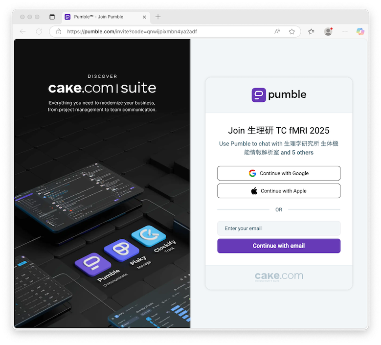

 - そうするとメールアドレスにコードが届きますので、コードを入力します。
  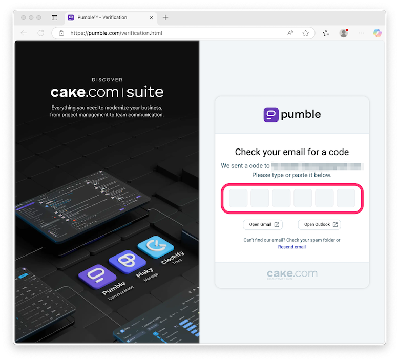
 
 - 次に氏名を記入します。皆様の氏名を日本人の方は日本語フルネームで、海外の方はカタカナフルネームでお書きください。
  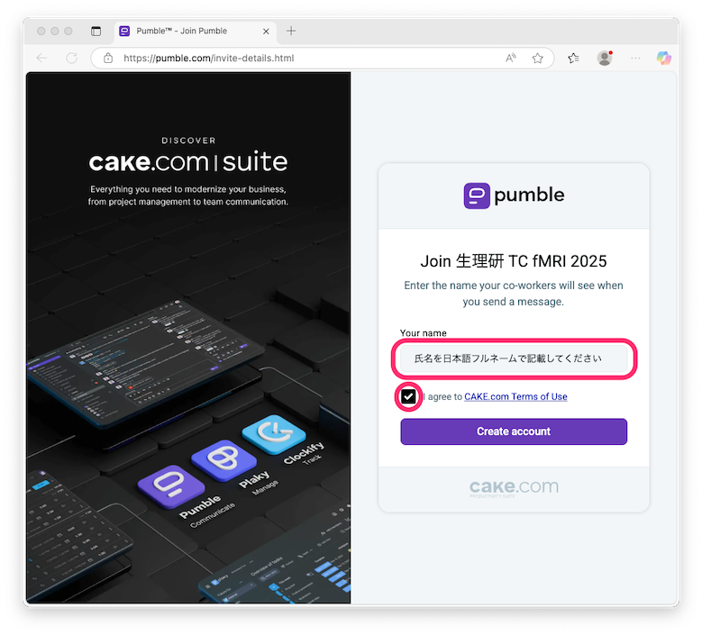

 - するとウェブブラウザ上で以下のような画面になります。これでログイン完了です。
  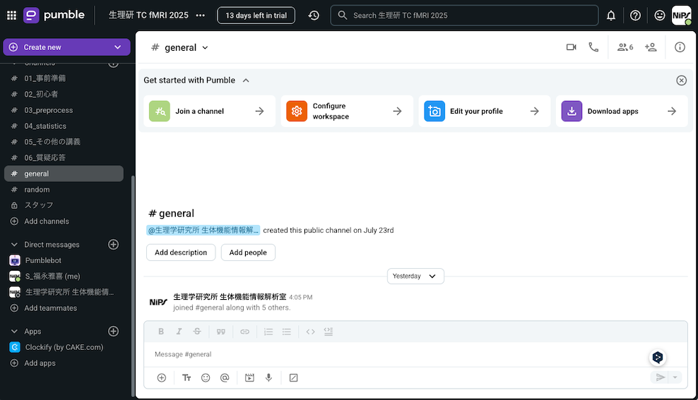

### アプリの入手

 - 次に、Pumbleのアプリをインストールします。**Lin4Neuroの内部ではなく、ご自身のWindows/macOSの方にPumbleアプリをインストールしてください。** macOS nativeの方はそのまま作業を進めます。
 - https://pumble.com/apps にアクセスしてください
 - ご自身のOSにあったインストーラーをダウンロードし、Pumbleのデスクトップアプリをインストールしてください。
  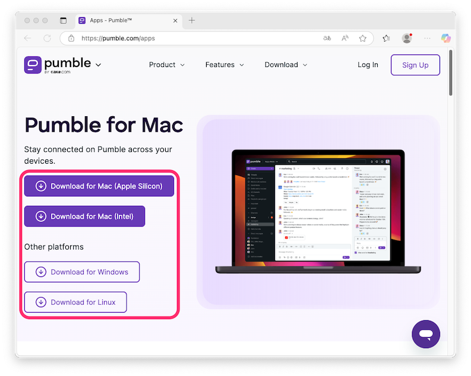
 - ログイン画面になりますので、"Login to Pumble" をクリックすると、ブラウザに先ほどと同じような画面が表示され、メールアドレスを入力するとコードが送られてきますので、それを入力しログインしてください。
  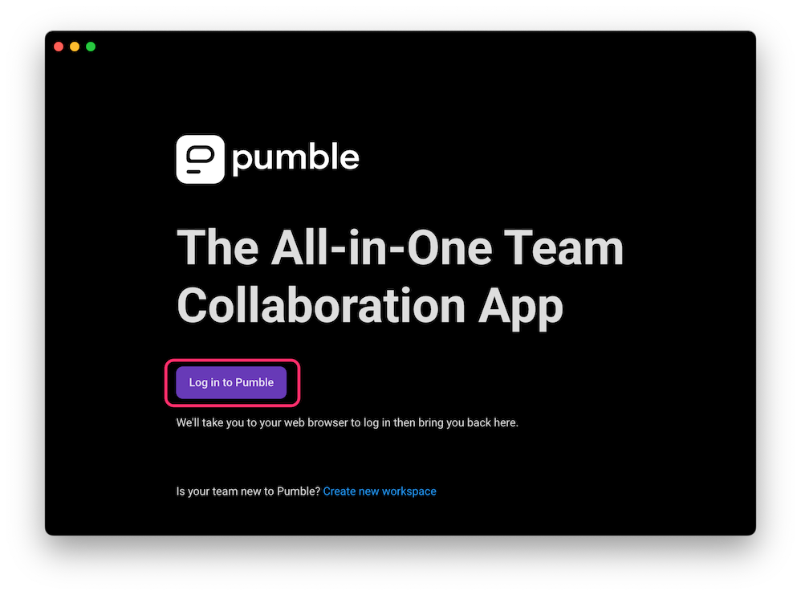
 - 以下の画面が出ればログイン成功です。チュートリアル当日まで、Pumbleの「00_事前準備」で連絡を行いますので、定期的にチェックしてください。
  

### チャンネルの使い分け

 - いくつかチャンネルが準備されています。以下のように使い分けていきます
 - 01_事前準備: 事前準備に関する連絡を行うチャンネルです。テキストのアップデートの連絡などをこちらで行います
 - 02_初心者: トレーニングコースにおいて、「講師に聞くほどでもないけど、初心者だから聞いておきたい」質問を受けるチャンネルです。講義中、講師はこのチャンネルは見ません。その代わり、チューターが皆様の質問に対してお答えします。
 - 03_preprocess: Preprocessingのの講義、実習に関する質問を受けるチャンネルです。
 - 04_statistics: 統計の講義、実習に関する質問を受けるチャンネルです。
 - 05_その他の講義: その他の講義に関する質問を受けるチャンネルです。
 - general: 上記以外の質問を受けるチャンネルです。質問により、回答できない場合があります

### お願い

 - トレーニングコースでは、すべて実名でやりとりをしたいと思います。ニックネームではなく、**ご自身の名前をフルネーム**で表示するようにしてください。 **スタッフはすべて氏名の前に"S_"** がついています
 - テキストだけのやりとりになりますので、どうぞやわらかな言葉での発言をしていただくようにお願いいたします。


----
## 4. Zoomの設定

- トレーニングコースはZoomにて開催します
- Zoomは、最新版をご利用ください。2026年7月22日現在、バージョン7.1.5になっています。
    - 以下のリンクをクリックすることで、最新版のZoomを入手できます。(すでにインストールされている方でも以下のリンクからインストーラーを入手することでアップデートできます)
    - [Zoom ダウンロードセンター](https://zoom.us/ja/download)

- 画面の共有の設定だけ変更すると受講しやすくなります
  
    - Zoomを起動し、ミーティングに参加をクリックします
      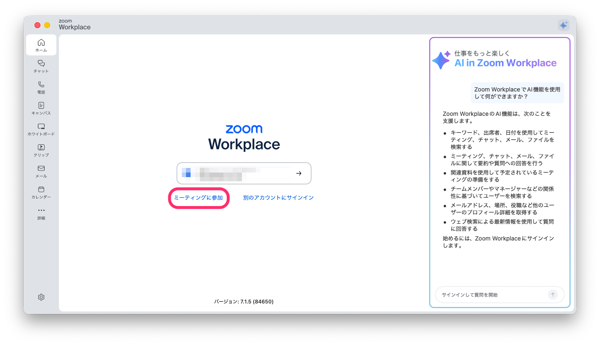

    - ミーティングに参加します（**Pumbleのgeneralチャンネルでお知らせするミーティングID、受講者氏名[実名]**）    
      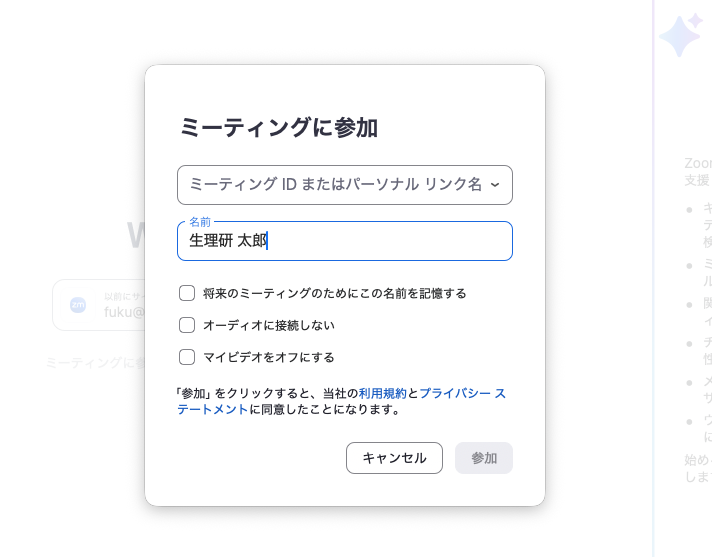

    - ミーティングパスコードを入力します（**Pumbleのgeneralチャンネルでお知らせするミーティングパスコード**）  
      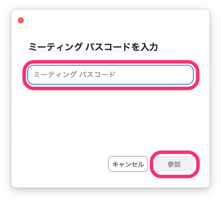

    - 続けて参加を選択します                                                     
      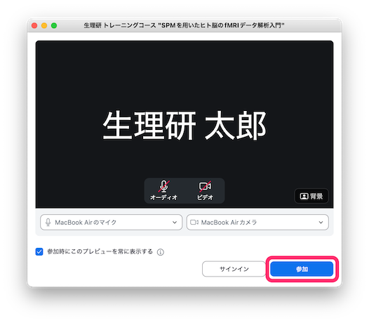
      
    - 正しくミーティングに参加できると下の画面が表示されます
      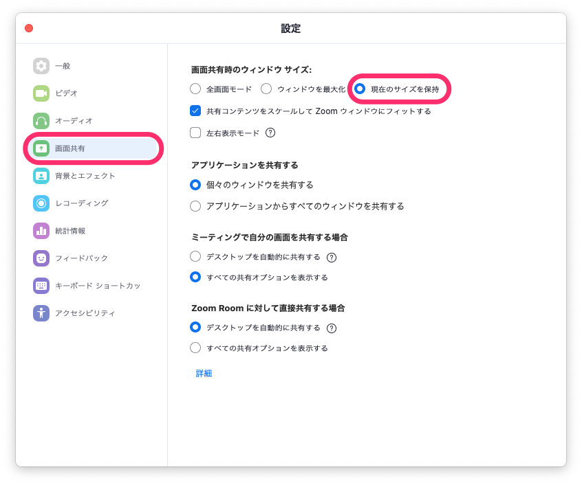
      
    - この画面が表示されている状態で、Zoomの設定画面を表示させます
    - 左のメニューから「画面共有」のタブをクリックし、「画面を表示するときのウィンドウのサイズ」を「現在のサイズを保持」に変更します。これにより、講師が画面を共有した場合に、Zoomが全画面モードにならずにすみます
      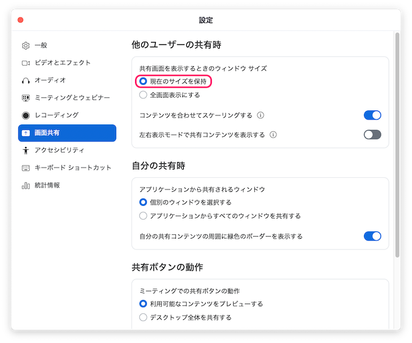
      
    - Zoomの設定は以上で終了です


----
## 5. テキストの入手

以下の3パターンで解説しますが、いずれも、外付けSSDにデータをダウンロードします。

 - Windows で Docker Desktop を使用してデータをダウンロードする場合
 - macOSでDocker Desktopを使用してデータをダウンロードする場合
 - macOS native で外付けSSDを使用してデータをダウンロードする場合
 
### 5-1. 各環境での準備
----
### 5-1-1. Windows で Docker Desktop を使用する場合
 - **【ポイント】データのダウンロードは Docker の外で行います。今は Docker Desktop は使用しません。**
#### WSL の準備
 - 最初に、　[Windows_WSL_Ubuntu](https://github.com/mfuku/nips-tc-fmri/wiki/Windows_WSL_Ubuntu) のページから、 WSL ubuntu のセットアップを行ってください。
#### WSL の起動およびリポジトリのダウンロード
 - Windows の Powershell から WSL を起動します。
    ```
    wsl -d ubuntu
    ```
 - 外付けSSDに移動します。Dドライブならば、以下のようになります。自分のドライブを確認して、Eドライブならば ```/mnt/e/share``` としてください。
    ```
    cd /mnt/d/share
    mkdir -p nips
    cd nips
    ```
 - ```ls``` で ```nips-2026tc``` がない方は、```nips-2026tc``` リポジトリをダウンロードします。ここで、**Pumble の general channel** を確認していただき、 ```git clone https://gitlab.com/``` から始まる一文をコピペしてください。
    ```
    git clone https://gitlab.com/(セキュリティのために省略)
    ```
 - ```ls``` で ```nips-2026tc```  がある方は、以下で 最新化します。
    ```
    cd nips-2026tc
    git pull
    ```
 - この後、「5-2. データの入手」に進んでください。

### 5-1-2. macOSでDocker Desktopを使用する場合
 - **【ポイント】データのダウンロードは Docker の外で行います。今は Docker Desktop は使用しません。**
 - MacOS でDocker Desktopを使う方は、 **Docker Desktopからでなく、macOSのターミナルから** 以下のようにしてください。
    ```
    cd /Volumes/自身のSSD/share
    mkdir -p nips
    cd nips
    ```
 - ```ls``` で ```nips-2026tc``` がない方は、```nips-2026tc``` リポジトリをダウンロードします。ここで、**Pumble の general channel** を確認していただき、 ```git clone https://gitlab.com/``` から始まる一文をコピペしてください。
    ```
    git clone https://gitlab.com/(セキュリティのために省略)
    ```
 - ```ls``` で ```nips-2026tc``` がある方は、以下で 最新化します。
    ```
    cd nips-2026tc
    git pull
    ```
 - この後、「5-2. データの入手」に進んでください。

### 5-1-3. macOS native でデータをダウンロードする場合
 - macOS nativeで受講される方は、**macOSのターミナル**から以下のようにしてください。
    ```
    cd /Volumes/自身のSSD/
    mkdir -p nips
    cd nips
    ```
 - ```ls``` で ```nips-2026tc``` がない方は、```nips-2026tc``` リポジトリをダウンロードします。ここで、**Pumble の general channel** を確認していただき、 ```git clone https://gitlab.com/``` から始まる一文をコピペしてください。
    ```
    git clone https://gitlab.com/(セキュリティのために省略)
    ```
 - ```ls``` で ```nips-2026tc``` がある方は、以下で 最新化します。
    ```
    cd nips-2026tc
    git pull
    ```
 - この後、「5-2. データの入手」に進んでください。


---

## ここまで
## 以下は準備中です。次のアナウンスがあるまで、作業を進めないようにしてください（7月27日時点）。

---


### 5-2. データの入手（共通）
----
 - 今、全員、```nips-2026tc``` にいる前提です。
 - **こちらも Docker Desktop ではない環境で行います。Windowsの方は Powershell の環境で、WSLの環境下で行います。MacOSの方も、 Docker Desktopからでなく、macOSのターミナルから行います。MacOS nativeの方も同様です。**
 - nips-2026 のディレクトリの中で以下を実行します。
    ```
    bash ./set_data.sh
    ```

 - 次のメッセージが表示されます。
    ```
    データのダウンロードを行います
   【重 要】今回配布されるMRIデータは、
    本トレーニングコースの実習目的に限って使用可能です
    データを他の目的で使用したり、
    配布したりしないで下さい（二次使用厳禁）
    同意していただいた方のみダウンロードできます
    同意しますか? 
    yesまたはnoを入力してください 
    ```
 - ここで yes とタイプしてEnterを押してください。
 - そうすると、データのダウンロードが始まります。トータルで **約10GB** になります。ポケットWi-Fiなどを使っている方はパケットが枯渇しますので、インターネット環境で作業されてください。また、ダウンロードには 1-1.5時間かかる場合があります。ゆっくりお待ちください。そして、ダウンロードされたファイルが展開されると、さらに **約20GB** 使用します。チュートリアルでさらに容量が増えますので、外付けディスクは十分に余裕をとってください。


----
----


## 2. トレーニングコーステキストの入手 (所要時間約3分)

- 本トレーニングコースで使用するテキストは、GitLabというデータ共有サービスを通して配布します。ここで配布されるものは、トレーニングコースの直前まで更新される可能性がありますので、こまめに（特に参加直前に）アップデートするようにして下さい

### 2a. Lin4Neuro の場合 (Win/Intel macでLin4Neuroを設定した方)

1. 初めてセットアップする時: ターミナル (Lin4Neuro では、左下のスタートアイコンの隣にあるアイコンから起動できます) から以下を実行して下さい

    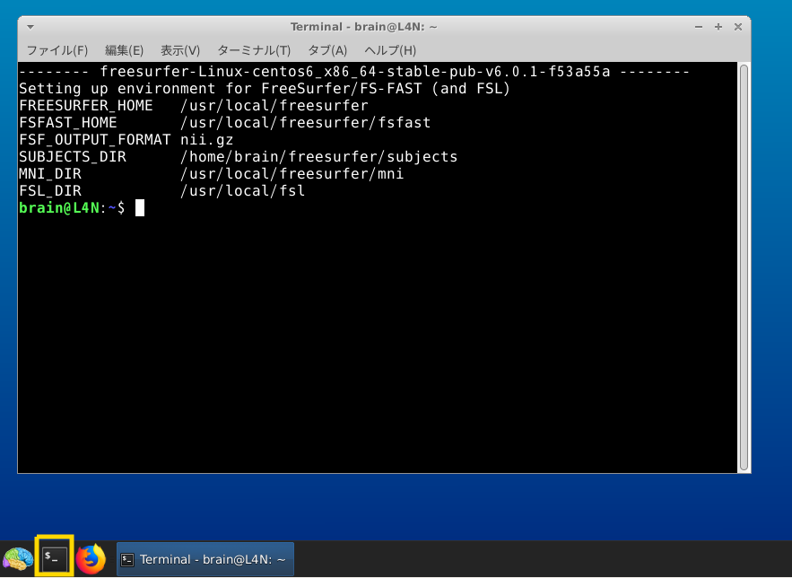

    ```
    cd
    mkdir nips-tc
    cd nips-tc
    Pumble の general channel で案内したコマンドをここにタイプします
    (セキュリティの都合でここには記しません)
    ```

    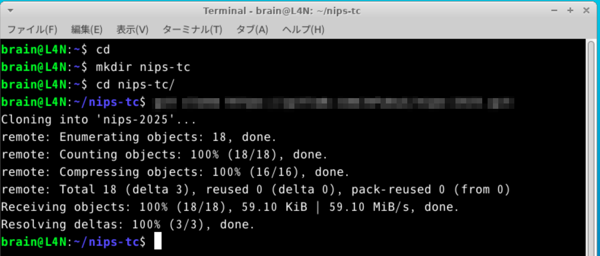

3. 更新する時: ターミナルから以下を実行してください

    ```
    cd
    cd nips-tc/nips-2025
    git pull
    ```

- こうすると、ホームディレクトリ`/home/brain` の下に`nips-tc`フォルダが、そのさらに下に`nips-2025`フォルダが作成され、 `nips-2025tc_test.m`, `nips-2025tc_textbook.html`, `set_data.sh` といったファイルが生成されます

    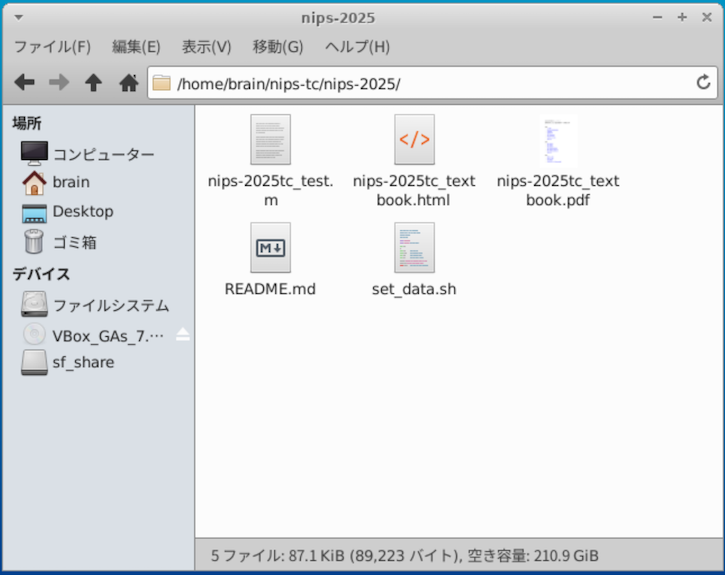


- `nips-2025tc_textbook.html` および `nips-2025tc_textbook.pdf` の中にテキストへのリンクが掲載されています

- その他のフォルダは講義で使用します

#### プロキシサーバーなどを使っている場合

- PCがプロキシサーバを経由して外部ネットワークに接続されている場合は、先にターミナルから以下のコマンドを入力し、Gitに対するプロキシ設定を行って下さい

    ```
    git config --global http.proxy  http://プロキシ名:ポート番号
    git config --global https.proxy http://プロキシ名:ポート番号
    ```

- プロキシ名やポート番号は、所属機関･部署のネットワーク管理者にお尋ね下さい

- プロキシ設定が不要になった時は、以下のコマンドによって解除できます：

    ```
    git config --global --unset http.proxy
    git config --global --unset https.proxy
    ```

### 2b. Mac native の場合

1. 初めてセットアップする時: ターミナルを開き、以下のコマンドを入力します。

    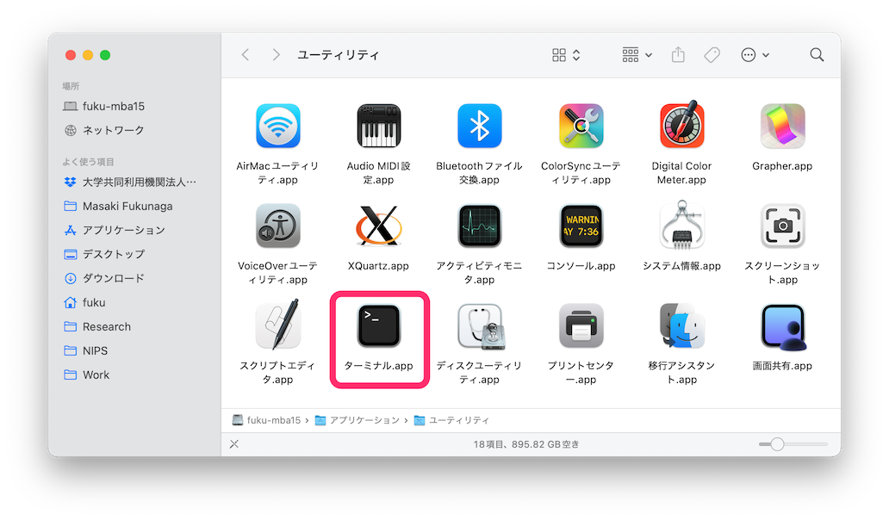

    ```
    cd
    mkdir nips-tc
    cd nips-tc
    Pumble の general channel で案内したコマンドをここにタイプします
    (セキュリティの都合でここには記しません)
    ```

    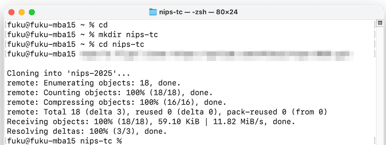

3. 更新する時: ターミナルから以下を実行してください

    ```
    cd
    cd nips-tc/nips-2025
    git pull
    ```

- こうすると、ホームディレクトリ`/Users/XXXX(自身のアカウント名)` の下に`nips-tc`フォルダが、そのさらに下に`nips-2025`フォルダが作成され、 `nips-2025tc_test.m`, `nips-2025tc_textbook.html`, `set_data.sh` といったファイルが生成されます

    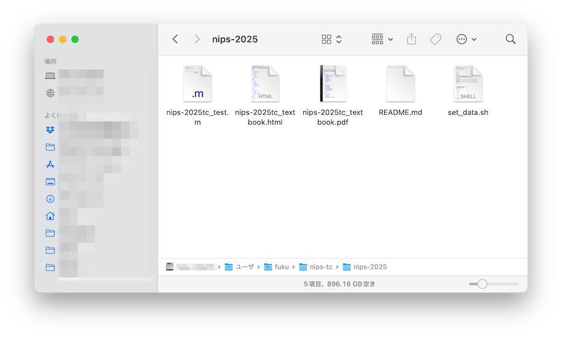


- `nips-2025tc_textbook.html` および `nips-2025tc_textbook.pdf` の中にテキストへのリンクが掲載されています

- その他のフォルダは講義で使用します


## 3. データの入手 (所要時間約15分, Lin4Neuro, Mac native 共通)

- トレーニングコースに使うデータは非常に大きいため、GitLabではなく、別にダウンロードしていただきます
   
- テキストのダウンロードを行った後、ターミナルから以下をタイプしてください

    ```
    cd
    cd nips-tc/nips-2025
    bash ./set_data.sh
    ```

- すると、データ利用に関して確認を求められます。`yes` と入力しリターンすると、ダウンロードが開始されます
- データは、全部で約8GBありますので、ネットワーク環境によって必要な時間が異なります(展開後は、約24GBとなります)

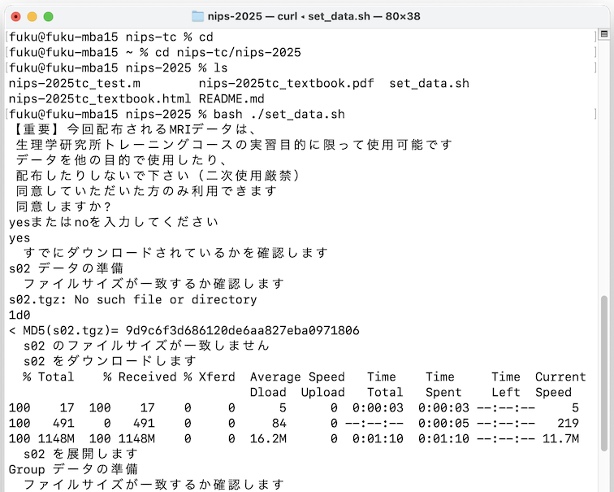

- データが全てダウンロードされると、**データの準備が全て整いました** と表示されます

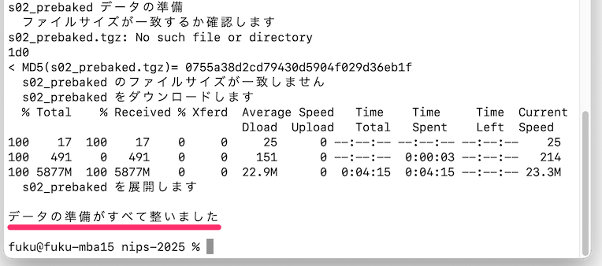
 
- `nips-2025` フォルダの中に `archive` `s02` `s02_prebaked` `Group` `Batch_GUI` `WBdata` フォルダができます
　
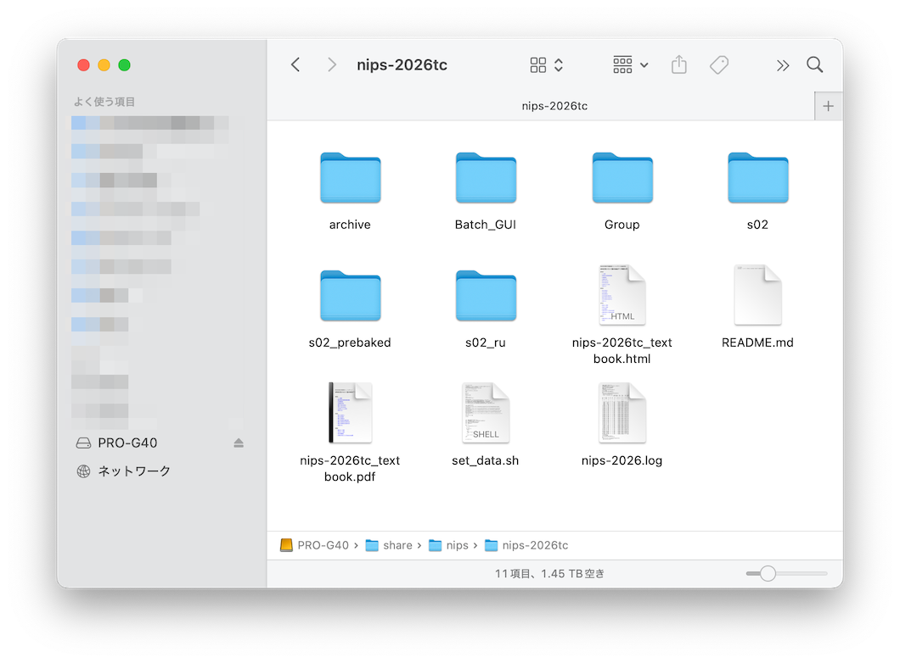

## 4. 確認のためのバッチスクリプトを実行 (所要時間約5分, Lin4Neuro, Mac native 共通)

- 環境が整っているかを確認するために、バッチスクリプトを実行していただきます

- SPMを起動してください

- SPM25 MenuウインドウからBatchを選択してください

    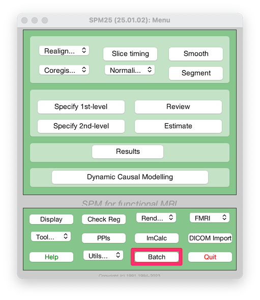

- 以下のウインドウが表示されますので、次の手順でバッチスクリプトを読み込みます

    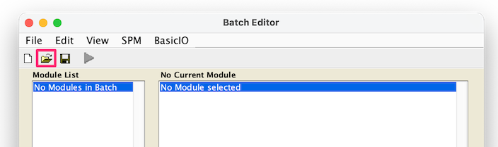
    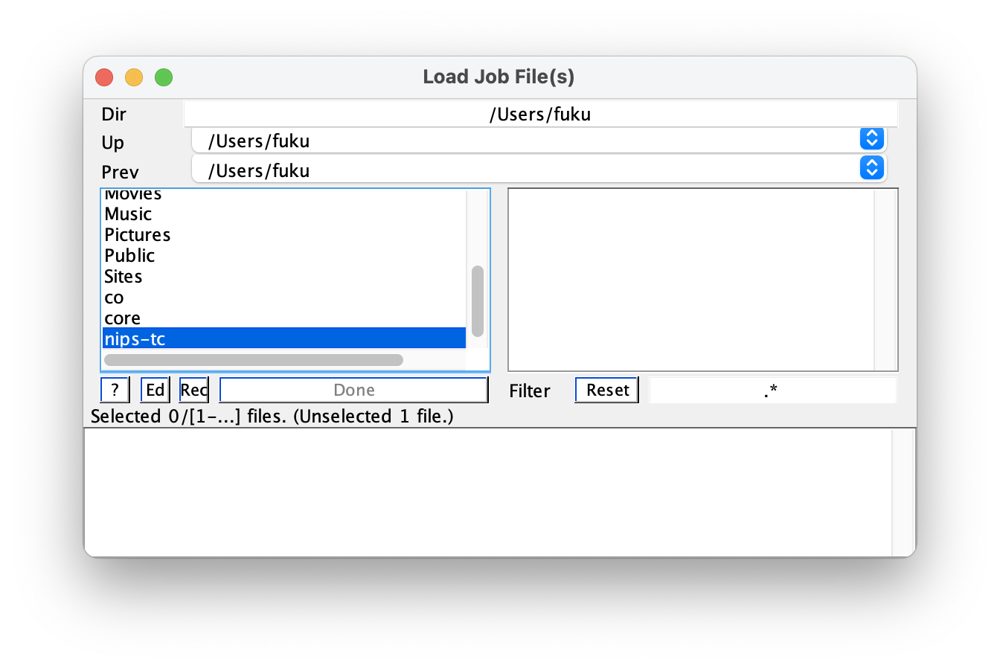
    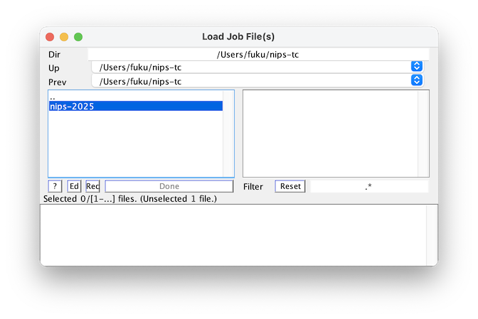
    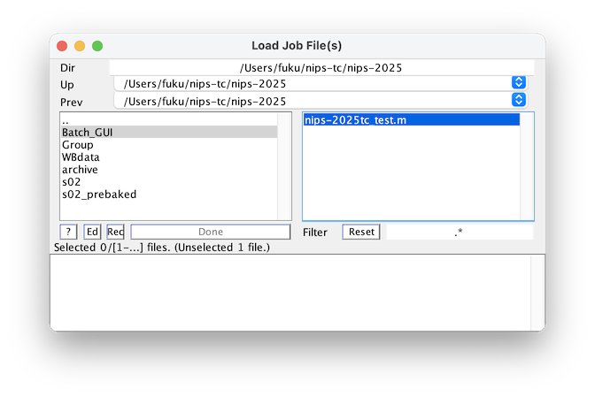

- `nips-2025tc_test.m` が選択されたことを確認して、DONEを選択します

    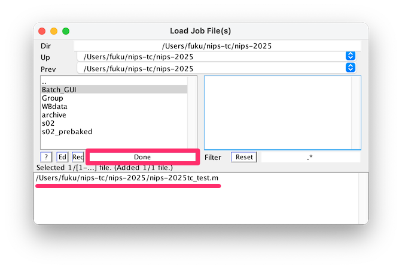

- ウインドウ上部の三角がグリーンに変化するので選択します

    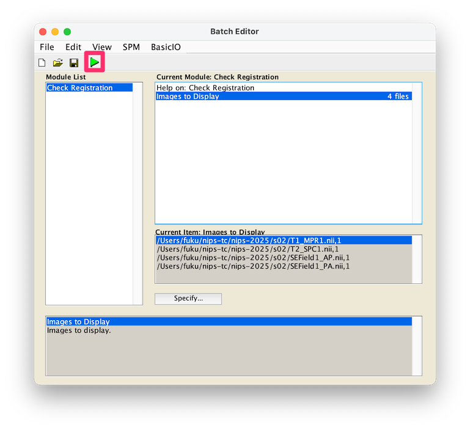

- MRIの断面画像が表示されます

    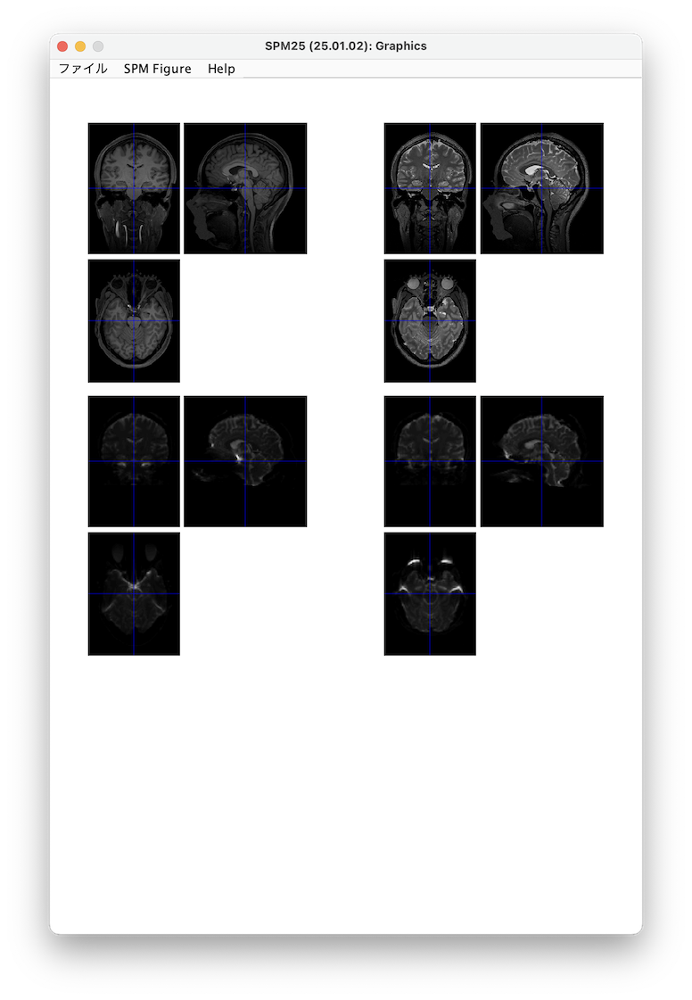

- 画像が正しく表示された方は、準備がすべて整ったことになります

    - もし、正しく表示できなかった場合は、データの入手からやり直して下さい

- ここまでたどりつけない場合は、事前サポートが必要になります。今回、Zoomのため、トレーニングコース当日の個別サポートが提供できませんので、このプロセスは必須とさせていただきます


---

## 問い合わせ

- 準備がうまくいかない時は、メールで案内した Pumble 生理研 TC fMRI 2026 の "01_事前準備" チャンネルで問い合わせ下さい。

- [生理研 TC fMRI 2026](https://app.pumble.com/workspace/6a623aa4451b1d6587b59e71/6a623aa417eacf6c3d141099)
