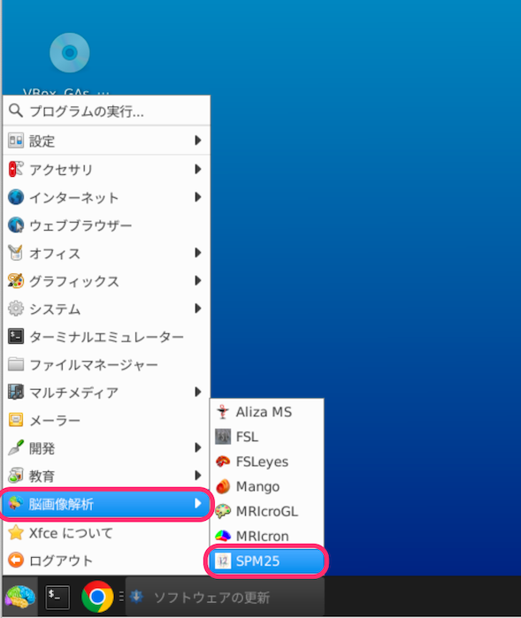
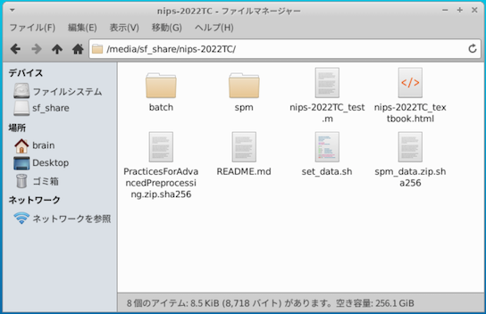
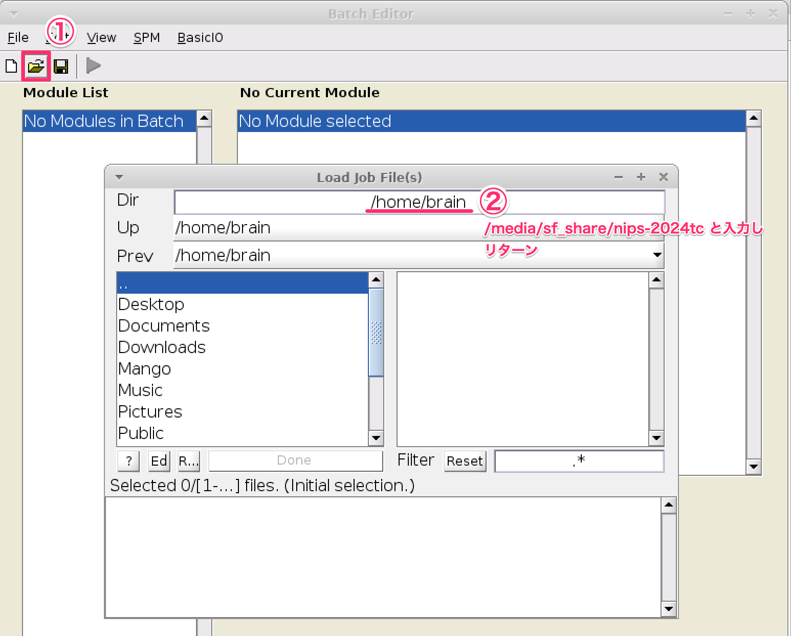
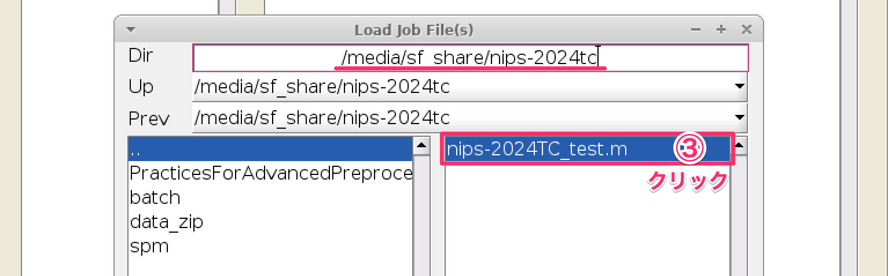

### 第36回生理科学実験技術トレーニングコース

# SPMを用いたヒト脳のfMRIデータ解析入門

2025年8月4-8月8日に生理学研究所でオンライン開催する **『第36回生理科学実験技術トレーニングコース・SPMを用いたヒト脳のfMRIデータ解析入門』** の参加者を対象とした情報提供サイトです。随時、情報を追加していきますので、このサイトへ定期的にアクセスするようにして下さい。

## 新着情報
- 2025.07.24 講義スケジュールの一部を変更しました
- 2025.07.18 トレーニングコース用ウェブサイトを立ち上げました


## スタッフ（運営、講師、チューター）
- 生理学研究所 脳機能計測・支援センター 生体機能情報解析室
- 国際電気通信基礎技術研究所(ATR) 河内山隆紀
- 筑波大学 根本清貴


## 開催案内
- オンライン開催です
- Zoomの開始時間は、**08:30** です


## 当日のタイムテーブル　(2025/7/24 時点)

日程 | 内容
---- | ----
8月5日（火） |
08:30 | Zoomオープン
09:00-09:20 | コース概要など説明（福永）
09:20-10:20 | 講義：機能的磁気共鳴現象画像法概論（福永）
10:20-10:40 | SPM概要説明（河内山）
10:40-11:00 | 講義：実験課題の説明（福永)
11:00-12:00 | 講義・実習：Preprocessing（小池・吉岡）
12:00-13:00 | -- 昼休み （Zoom 集合写真）--
13:00-16:15 | 講義・実習：Preprocessing（小池・吉岡）
16:15-17:00 | 講義・実習：GUIを用いたバッチ作成（郷田）
8月6日（水） |
08:30       | Zoomオープン
09:00-11:00 | 講義：統計検定１（河内山）
11:00-12:00 | 実習：個人解析（吉岡）
12:00-13:00 | -- 昼休み --
13:00-14:00 | 講義：統計検定２（河内山）
14:00-15:30 | 実習：個人解析と結果の表示（吉岡）
15:30-17:00 | 講義・実習：表の読み方と図の作り方（小笠原）
18:00- | オンライン交流会
8月7日（木） |
08:30 | Zoomオープン
9:00-10:00 | 講義：グループ解析（河内山）
10:00-11:00 | 実習：グループ解析（吉岡）
11:00-12:30 | 講義：fMRIの課題設計（小池）
12:30-13:30 | -- 昼休み --
13:30-15:00 | 講義：応用的な手法について（HCP pipeline）(山本）
15:00-17:00 | 講義：応用的な手法について（Preprocessing）(山本）
8月8日（金） |
08:30 | Zoomオープン
9:00-11:00 | 講義：応用的な手法について（fMRI編）（山本）
11:00-12:00 | 質疑応答・個別質問など
13:00-15:00 | 予備時間
 |


----
### パソコンの準備について
 - トレーニングコースでは、受講者にご自身でPCを準備して頂き、実際に操作しながら学んでいきます。PCのスペックについては、以下の **推奨条件** を参考にして下さい

    - OS: Windows10,11 64bit版 または macOS 10.15（Catalina）以降
    - CPU: Intel Core i7/i9、Intel Core i5（クロック周波数2.0GHz以上）、または AMD Ryzen 5以上の性能を有するもの
     - **注意: 現在、Apple Silicon (M1/M2/M3/M4) はVirtualBoxで仮想マシンを動作できないため、Lin4Neuroは動作できません。以下の Mac native のソフトウエア準備をご覧ください**
    - メモリ：8GB以上 (可能ならば16GB以上を推奨します)
    - ハードディスク：100GB以上の空き容量 (外付けハードディスクも可)
    - 2ボタン以上のUSBマウス (必須ではありませんが、持っていると便利です)

- **Windows, Intel mac の方はLin4Neuroでソフトウェアがすべてセットアップされた環境を入手できます。macOS native (Apple M1/M2/M3/M4を含む) の方は、個人で準備していただく必要があります。**
- Zoomは画面共有でメモリを相当消費します。そのため、Zoomで受講するための別のPCもしくはタブレットをご準備ください。解析用のPCとZoom用のPCは別々で全く支障ありません

----
### 解析環境のセットアップ
 - トレーニングコースでは、ご自身の環境で受講していただきます。そのために**事前準備が必須**となっております。講師と同じ環境で解析をするため、仮想化ソフト VirtualBox を使用し、そのうえで、脳画像解析に特化したLinux, Lin4Neuro を使いながらチュートリアルは進めていきます。(なお、Apple Silicon をお使いの方は VirtualBox がamd64に完全に対応していないので、個別にソフトウェアをセットアップしていただくことになります。ご注意ください。) 準備に、約3-4時間必要となります。事前準備を済ませたうえで、受講するようにしてください。**トレーニングコース当日に準備する時間はありません。**
 - 本コースは、完全オンライン開催のため、以下に記載するセットアップによる準備を前提とします。脳画像解析の初心者の方々は、記載されている通りに事前準備を行いトレーニングコースへ参加することを強く推奨します。
 - **Lin4Neuroは、筑波大学の根本清貴先生が開発、配布されているLinux上に構築された脳画像解析ツール群です。根本先生のご厚意により、トレーニングコースで利用させて頂きます。**
    - [Lin4Neuro](https://www.nemotos.net/?page_id=161)
 - 自分自身で基礎的なトラブルシューティングが行える脳画像解析の経験が豊富な中級者以上の方々は、受講者専用サイトに記載されている以外の解析環境（例えば受講者自身が構築した解析環境など）でもトレーニングコースに参加可能ですが、原則としてチューターによるサポートの対象外とさせて頂きます。ご理解、ご協力の程、よろしくお願いします
 - 今回のトレーニングコースで使用するLin4Neuroのバージョンは、L4N-2204-NIPS-20250428です。**過去のLin4Neuroは使用できませんのでご注意ください**
 - ソフトウェアとデータのダウンロードで合計**30GB程度ダウンロードします**。Pocket Wi-Fiなどでは通信量にご注意下さい。**職場やご自宅のLAN環境からの作業**を強くお奨めします

### ソフトウエアの準備

### Windows, Intel mac で VirtualBox経由で Lin4Neuro を使用
 - [Lin4Neuroのセットアップ](https://kytk.github.io/nips-web-2025/L4N_setup.html) をご確認ください。

### macOS native (Apple Silicon M1-M4 を含む) でソフトウェアを準備
 - [macOSでのセットアップ](https://kytk.github.io/nips-web-2025/macOS_native.html) をご確認ください。("SPMコースでは不要です"と記載のある項目は、"SPMを用いたヒト脳のfMRIデータ解析入門"では使用しないソフトウエアです。本コースの受講には必要ありません。ディスクスペースに大きな余裕があればインストールされても構いませんが、準備時間が大きく増加することをご考慮ください。) 

  
----
## Zoomの設定

- トレーニングコースはZoomにて開催します
- Zoomは2025年7月22日現在、バージョン6.5.7になっています。こちらを入手してください
    - 以下のリンクをクリックすることで、最新版のZoomを入手できます。(すでにインストールされている方でも以下のリンクからインストーラーを入手することでアップデートできます)
    - [Zoom ダウンロードセンター](https://zoom.us/ja/download)

- 画面の共有の設定だけ変更すると受講しやすくなります
    - Zoomを起動し、ミーティングに参加をクリックします

    

    - ミーティングに参加します（ **メールでお知らせしたミーティングID、受講者氏名[実名]** を入力）

    

    - ミーティングパスコードを入力します（ **メールでお知らせしたミーティングパスコード** を入力）

    

    - 続けて参加を選択します
  
    

    - 正しくミーティングに参加できると下の画面が表示されます
  
    

    - この画面が表示されている状態で、Zoomの設定画面を表示させます
    - 左のメニューから「画面共有」のタブをクリックし、「画面を表示するときのウィンドウのサイズ」を「現在のサイズを保持」に変更します。これにより、講師が画面を共有した場合に、Zoomが全画面モードにならずにすみます

    

    - Zoomの設定は以上で終了です

----

## Pumbleの設定

- トレーニングコースでは Pumble というツールを使って、事務連絡や当日の質疑応答を行います。以下の手順で設定してください


### ウェブブラウザでの設定

 - 受講者の皆様にメールで招待リンクをお知らせします。
   **`https://invite.pumble.com/XXXXXXXXX`**のようなリンクです。

 - Pumbleのログイン画面に進みます。"Continue With Google" をクリックしてGoogleアカウントで入っても、ご自身の独自のメールアドレスを入力してから"Contineu with email" をクリックしてもかまいません。

 　

 - そうするとメールアドレスにコードが届きますので、コードを入力します。

  
 
 - 次に氏名を記入します。皆様の氏名を日本人の方は日本語フルネームで、海外の方はカタカナフルネームでお書きください。

  

 - するとウェブブラウザ上で以下のような画面になります。これでログイン完了です。

  


### アプリの入手

 - 次に、Pumbleのアプリをインストールします。**Lin4Neuroの内部ではなく、ご自身のWindows/macOSの方にPumbleアプリをインストールしてください。** macOS nativeの方はそのまま作業を進めます。

 - https://pumble.com/apps にアクセスしてください

 - ご自身のOSにあったインストーラーをダウンロードし、Pumbleのデスクトップアプリをインストールしてください。

  

 - ログイン画面になりますので、"Login to Pumble" をクリックすると、ブラウザに先ほどと同じような画面が表示され、メールアドレスを入力するとコードが送られてきますので、それを入力しログインしてください。

  
  
 - 以下の画面が出ればログイン成功です。チュートリアル当日まで、Pumbleの「00_事前準備」で連絡を行いますので、定期的にチェックしてください。

  


### チャンネルの使い分け

 - いくつかチャンネルが準備されています。以下のように使い分けていきます

 - 01_事前準備: 事前準備に関する連絡を行うチャンネルです。テキストのアップデートの連絡などをこちらで行います

 - 02_初心者: トレーニングコースにおいて、「講師に聞くほどでもないけど、初心者だから聞いておきたい」質問を受けるチャンネルです。講義中、講師はこのチャンネルは見ません。その代わり、チューターが皆様の質問に対してお答えします。

 - 03_preprocess: Preprocessingのの講義、実習に関する質問を受けるチャンネルです。

 - 04_statistics: 統計の講義、実習に関する質問を受けるチャンネルです。

 - 05_その他の講義: その他の講義に関する質問を受けるチャンネルです。

 - general: 上記以外の質問を受けるチャンネルです。質問により、回答できない場合があります

### お願い

 - トレーニングコースでは、すべて実名でやりとりをしたいと思います。ニックネームではなく、**ご自身の名前をフルネーム**で表示するようにしてください。 **スタッフはすべて氏名の前に"S_"** がついています

 - テキストだけのやりとりになりますので、どうぞやわらかな言葉での発言をしていただくようにお願いいたします。


----

----

## SPMの事前確認

### 1. Lin4Neuro の場合

- Lin4Neuroにログインします

- 画面左下の脳アイコンをクリックし、脳画像解析からSPM25を選択します。

    

- fMRIを選択して下さい。

   

- 以下のような画面が出ます。SPMを使用中は、このターミナルを閉じないで下さい

    

- 少し時間がかかりますが、以下のようなウインドウが出れば、SPMがきちんと動作することを確認できます

    

- 起動の確認が終われば、"Quit" を選択してSPMを終了します


### 2. Mac native の場合

- Mac native 環境のセットアップ時に、SPMの起動を確認しています。
- アイコンではなくターミナルからの起動を心掛けてください（重要なメッセージがターミナル画面に表示されます）。 
 
 
---

## ここまで 
## 以下は準備中です。次のアナウンスがあるまで、作業を進めないようにしてください（7月25日時点）。

---


 
### 2. トレーニングコーステキストの入手 (所要時間約3分)

- 本トレーニングコースで使用するテキストは、GitLabというデータ共有サービスを通して配布します。ここで配布されるものは、トレーニングコースの直前まで更新される可能性がありますので、こまめに（特に参加直前に）アップデートするようにして下さい

1. 初めてセットアップする時: ターミナル (Lin4Neuro では、左下のスタートアイコンの隣にあるアイコンから起動できます) から以下を実行して下さい

    

    ```
    cd /media/sf_share
    メールで示されているコマンドをここにタイプします
    (セキュリティの都合でここには記しません)
    ```

3. 更新する時: ターミナルから以下を実行してください

    ```
    cd /media/sf_share/nips-2024tc
    git pull
    ```

- こうすると、`/media/sf_share/nips-2024tc` の下に `spm`, `nips-2024TC_test.m`, `nips-2024TC_textbook.html`, `set_data.sh` といったフォルダやファイルが生成されます

    


- `nips-2024TC_textbook.html` の中にテキストへのリンクが掲載されています

- その他のフォルダは講義で使用します

#### プロキシサーバーなどを使っている場合

- PCがプロキシサーバを経由して外部ネットワークに接続されている場合は、先にターミナルから以下のコマンドを入力し、Gitに対するプロキシ設定を行って下さい

    ```
    git config --global http.proxy  http://プロキシ名:ポート番号
    git config --global https.proxy http://プロキシ名:ポート番号
    ```

- プロキシ名やポート番号は、所属機関･部署のネットワーク管理者にお尋ね下さい

- プロキシ設定が不要になった時は、以下のコマンドによって解除できます：

    ```
    git config --global --unset http.proxy
    git config --global --unset https.proxy
    ```

### 3. データの入手 (所要時間約10分)

- トレーニングコースに使うデータは非常に大きいため、GitLabではなく、別にダウンロードしていただきます
   
- データのダウンロードを行った後、ターミナルから以下をタイプしてください

    ```
    cd /media/sf_share/nips-2024tc
    bash ./set_data.sh
    ```

- こうすると、`spm` フォルダに `Localizer` `LOOanalysis` `Manuals` が、`PracticesForAdvancedPreprocessing` フォルダに `DICOM` `Practice2_Topup` `Script_SetUpFilesForPractice1.sh` ができます
　


### 4. 確認のためのバッチスクリプトを実行 (所要時間約5分)

- 環境が整っているかを確認するために、バッチスクリプトを実行していただきます

- ターミナルからSPMを起動してください

- SPM12 MenuウインドウからBatchを選択してください

    

- 以下のウインドウが表示されますので、①-②-③の順でバッチスクリプトを読み込みます

    
    

- `nips-2024TC_test.m` が選択されたことを確認して、DONEを選択します

    

- ウインドウ上部の三角がグリーンに変化するので選択します

    

- MRIの断面画像が表示されます

    

- 画像が正しく表示された方は、準備がすべて整ったことになります

    - もし、正しく表示できなかった場合は、データの入手からやり直して下さい

- ここまでたどりつけない場合は、事前サポートが必要になります。今回、Zoomのため、トレーニングコース当日の個別サポートが提供できませんので、このプロセスは必須とさせていただきます


### 5. Lin4Neuro への Google chrome のインストール (所要時間5分)

- Lin4NeuroにGoogle Chromeをインストールしたい方向けに、説明動画を準備しました。[こちら](https://vimeo.com/487737208)からご確認ください
 

---

## 問い合わせ

- 準備がうまくいかない時は、メールで案内した Pumble 生理研 TC fMRI 2025 の "01_事前準備" チャンネルで問い合わせ下さい。

- [生理研 TC fMRI 2025](https://app.pumble.com/workspace/688089c58184dd7952ad2f57/6880d0be786c3e1240b84fc0)
